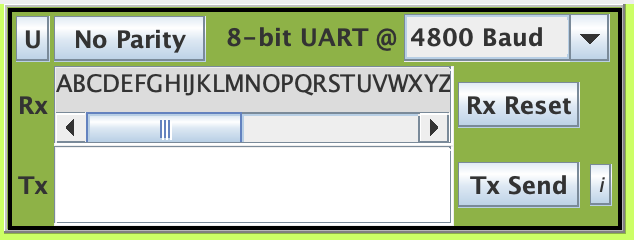

# Operating System 2019 Spring Checkpoint 01

## Cooperative Multithreading
For this programming project checkpoint, you are to write a cooperative multithreading package (as presented during the week of 10/14-10/16) and a test case based on the single-buffer producer-consumer example. Cooperative multithreading means the code for each thread needs to explicitly do a thread-yield in order to switch to another thread, if any.

## Todo
1. **Turn in the source files for preemptive multithreading to be compiled using SDCC and targets EdSim51.**
2. testcoop.c , which contains the startup code and sets up the
producer-consumer example.
3. cooperative.c , cooperative.h , which contains the cooperative
multithreading code.
4. Turn in the typescript for compiling your code using the provided Makefile.

## Scoring (Check detailed requirments via iLMS)

| **Item**                                         | **Score** |
| :----------------------------------------------: | :-------: |
| testcoop.c                                    | 25%       |
| cooperative.c                                     | 55%       |
| Typescript for compilation                        | 2%        |
| Screenshots and explanation                      | 18%       |

## Report below here
### Screenchot
</img>
